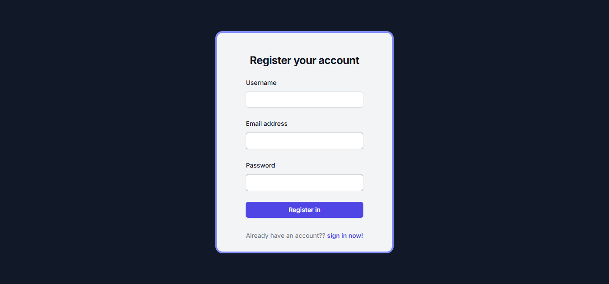
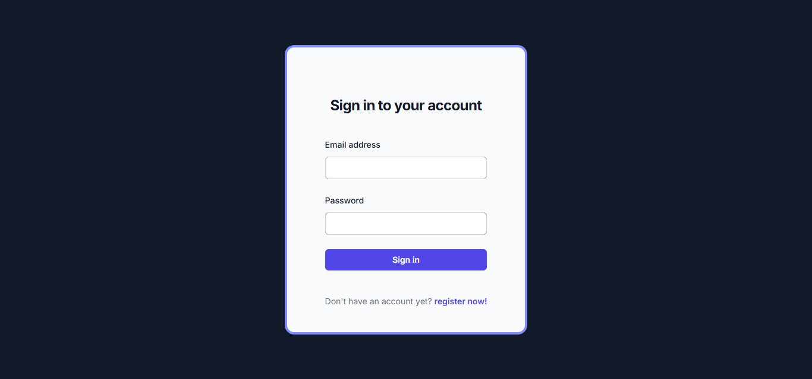
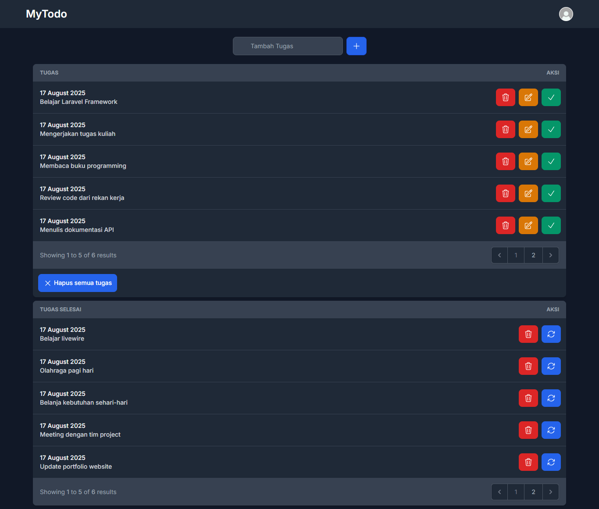

# 📝 MyTodo - To-Do List App

MyTodo adalah aplikasi to-do list yang berfungsi untuk membantu pengguna mencatat, mengatur, dan menyelesaikan tugas harian dengan mudah. Dengan tampilan yang clean dan fitur intuitif seperti tambah, hapus, dan tandai tugas selesai, aplikasi ini cocok untuk siapa pun yang ingin meningkatkan produktivitas hariannya.

## 🚀 Fitur Utama

- ✅ Tambah tugas baru
- ❌ Hapus tugas
- 🟢 Tandai tugas sebagai selesai
- 🔐 Autentikasi pengguna (Login & Register)
- 🎨 Tampilan sederhana dan responsif

## 🛠️ Teknologi yang Digunakan

- [Laravel](https://laravel.com/) 12
- Blade Template Engine
- Tailwind CSS
- MySQL

## 📦 Instalasi & Setup

1. Clone repository
 ini:

```bash
git clone https://github.com/username/mytodo.git
cd mytodo
```

2. Install dependency:

```bash
composer install
npm install && npm run dev
```

3. Buat database dan konfigurasi .env:

```bash
DB_DATABASE=mytodo
DB_USERNAME=root
DB_PASSWORD=your_password
```

5. Jalankan migrasi:

```bash
php artisan migrate
```

6. Jalankan server lokal:

```bash
php artisan serve
```

## 📸 Screenshot

### 🔐 Halaman Autentikasi
- **Register Page**  
  

- **Login Page**  
  

---

### 📋 Halaman Utama

- **Home Page**  
  

- **Todo Page**  
  
